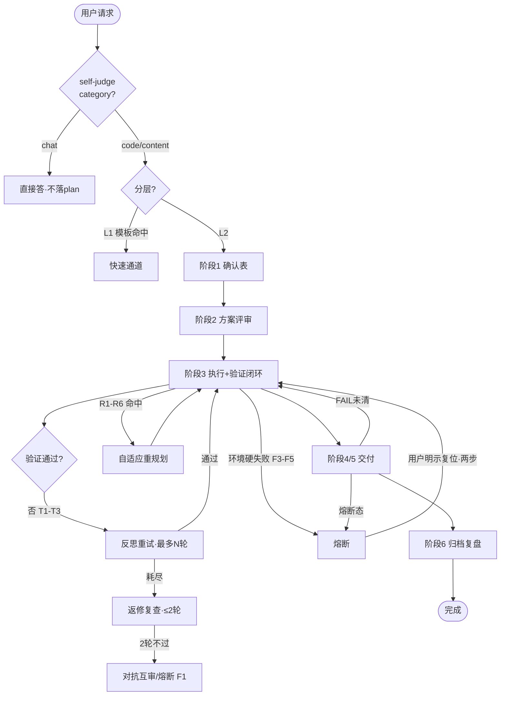

# 流程模型（ai-workflow 流程活动图与决策节点）

> **定位**：把「六阶段主干 + 多闭环」显式为**流程模型**——一份活动图（mermaid）+ 一张决策节点表（R/F/T 触发点映射）。它是 P0 数据模型 / 状态模型之上的"**流转层**"，回答"**什么时机回流到哪个闭环**"。
> **版本**：1（2026-09-21，P2-1 新增）
>
> ⚠️ **建模边界（写在最前）**：本流程本质是「**纪律 + 留痕**」而非纯可执行 DAG——很多节点是"人审 / 纪律"，**不该硬塞进状态机或强制编排**。流程模型只描述「可机判定的流转」；**人审节点标为人工网关**（见 §四），不假装能自动执行。纯文档/可视化，不阻塞质量、不新增门禁。

---

## 一、阶段主干（6 阶段）

| 阶段 | 职责 | 关键产出 | 性质 |
| --- | --- | --- | --- |
| 0 意图快判 | self-judge 分类 + 入口分型 + 查 Skill + 定工作区根 | `meta.入口判定`、任务分层 L0/L1/L2 | 判别（快） |
| 1 上下文收集 | 三类并行收集 + 材料理解 + 六要素确认 | 任务确认表、用户放行留痕 | 收集/对齐 |
| 2 调研与方案评审 | 查重 + 证据分级 + ≥2 候选方案对比 | 复用决策、方案评审结论 | 决策 |
| 3 AI 处理 | 计划→验证闭环→精检索→编排→质检 | `plan.yaml` 步骤推进、`trace.jsonl` | 执行 |
| 4 Office 产出 | 生成 Excel/Word/PDF | 交付文件 | 产出 |
| 5 测试交付 | 验证信号 + Anti-drop 对账 + 熔断门禁 + 出站扫描 | 自检表、present_files | 验收 |
| 6 结果核验 | 达成判定 + 履历归档 + 复盘四问 + 沉淀分流 | `Ledger.md` 行、`_metrics.jsonl` | 收尾 |

---

## 二、关键闭环与子机制（决定"何时回流"的才是重点）

| 机制 | 位置 | 触发 | 去向 |
| --- | --- | --- | --- |
| 自主决策层 | 贯穿全阶段 | 能力路由 / 自适应计划 / 方法选用 | 见 `decision-tables.md` |
| 反思重试 | 阶段 3 内层（验证失败第一响应） | T1–T3 | 耗尽 → 返修复查 |
| 返修复查 | 阶段 3/5（人工/审核驱动） | 反思重试触顶 | 2 轮不过 → 对抗互审 → 熔断 F1 |
| 熔断 | 末梢兜底 | F1–F5（含 T 触顶 / 环境硬失败） | 停止自动化，等用户复位 |
| 子代理编排 | 阶段 3（算力类能力） | 能力类=算力 | Handoff 结构化派发 |
| 自适应计划 | 阶段 3（执行中） | R1–R6 | 重规划（先留痕再改） |

---

## 三、活动图（mermaid）

> ⚠ **人工网关**（图中未显式画的"纪律节点"）：阶段 1 六要素确认、阶段 2 方案评审、用户放行、返修复查的问题清单、熔断复位——这些由人/纪律驱动，不在自动 DAG 内。

---

## 四、决策节点表（R / F / T 触发点映射）

| 节点 | 触发判据 | 决策 | 去向 | 机检 | 人工网关 |
| --- | --- | --- | --- | --- | --- |
| 入口分类 | self-judge `category` ∈ {chat,code,content} | 定分层 L0/L1/L2 | 直答 / 快速通道 / 全流程 | 检查项 13（WARN） | 模糊 → 澄清（fail-closed） |
| 重规划 | R1–R6 任一命中 | 必须重规划 | 先留痕再改 steps | 口径守卫（取值） | 改"目标/事实"才重规划 |
| 反思重试 | T1–T3 命中且未耗尽重试 | 调参再跑 | 同实现复跑 | 重试次数 ≤ 上限（机检） | 反思质量靠抽查 |
| 返修复查 | 反思重试触顶 | 带问题清单回归 | 2 轮 → 对抗互审 | — | ✅ 人工/审核驱动 |
| 熔断 F1 | 返修 2 轮 + 对抗互审仍不过 | 熔断 | 停/冻/证/拦/报 | `_check_fuse`（FAIL） | 须硬证据 |
| 熔断 F3–F5 | 环境类硬失败 / 越界 / 配额硬阻断 | 熔断 | 不耗重试次数 | `_check_fuse` | 须硬证据 |
| 复位 | 用户明示（两步缺一不可） | 已熔断→正常 | 回阶段 3 一次性重试 | `_check_fuse` | ✅ 仅用户 |
| 出站 | 将外发全部文件 | 扫描 + 列清单 | 阻断/放行 | 第 3/4 项机检 | 第 1/2/5/6/7/8 纪律 |

---

## 五、人审网关标注（流程模型不自动执行的部分）

以下节点**只能由人或纪律驱动**，流程模型显式标出，避免"有图却什么也没保证"的假安全感：

1. 阶段 1 六要素确认与用户放行（红线①：用户确认前不执行）。
2. 阶段 2 方案评审的"≥2 候选对比"结论。
3. 返修复查的问题清单与对抗互审裁决。
4. 熔断复位（须用户明示，且两步缺一不可——见 `state-model.md` §三）。
5. 出站清单的"可见性 / 留存期 / 回滚"确认。

---

## 六、诚实边界

1. **流程模型是蓝图，不是编排器** —— 它描述"何时回流"，不强制"必须回流"；纪律节点（§五）的履行靠人，不靠图。
2. **与状态模型 / 决策模型正交** —— 状态模型管"状态与迁移"（`state-model.md`），决策模型管"输入→输出映射"（`decision-tables.md`），本文件管"流转时序"，三者互补不重叠。
3. **R/F/T 计数正交** —— 重规划次数 ≠ 反思重试次数 ≠ 返修复查轮次（见 `reflection-retry.md` §6 计数纪律），报告时显式区分。

---

## 变更记录

- **v1（2026-09-21，P2-1）**：新增本文件。把六阶段主干 + 子循环显式为活动图与决策节点表（R/F/T 触发点映射），并标注人工网关与诚实边界。背景：P0 建模分析把"流程模型（4.3）"列为 P2，价值在可读性与未来编排，当前不阻塞质量。
  - ⚠ **纯文档/可视化**：未新增任何门禁或解析器；活动图与 §二/§四均依据 `SKILL.md` 阶段 0–6 与四份决策/状态源手册实测内容，不凭印象。
  - ⚠ **与 P0 模型衔接**：熔断/复位节点以 `state-model.md` 为唯一口径源；R/T 触发以 `decision-tables.md` 为集中映射。
