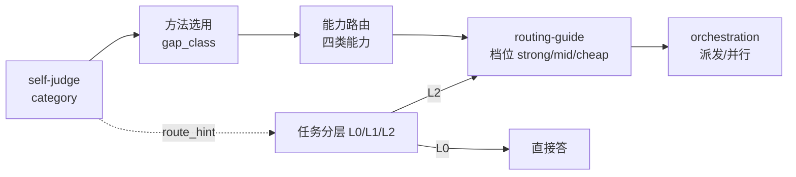

# 路由模型（ai-workflow 档位映射与 category 联动）

> **定位**：把「阶段感知模型档位」做成**映射表 + 与 `self-judge` category 的联动图**——集中可视化，避免散落描述。它复用 `routing-guide.md` 的既有范式，**不重复造取值源**。
> **版本**：1（2026-09-21，P2-2 新增）
>
> ⚠️ **权威源声明（必读）**：**档位取值单一源 = `references/routing-guide.md`**（已被 `checks.py plan` 的「模型档位合法」判据机检）。本文件只做**映射与联动**，取值改动走 `routing-guide.md`（及其背后的 `scripts/model_tiers.json`），不在此重述。

---

## 一、档位取值（引用，不重述）

> 完整定义 / 模型 / 价目见 `routing-guide.md` §二；此处仅列映射所需的取值。

| 档位 | 适用 | 参与降本测算 |
| --- | --- | --- |
| **strong** | 规划 / 关键实现 / 安全相关 | ✅ |
| **mid** | 常规实现 | ✅ |
| **cheap** | 探索 / 调研 / 测试 / 文档 / 格式转换 | ✅（本地 Ollama，0 成本） |
| **default** | 显式声明"按阶段默认档位"（语义=留空） | ❌ 只用于留痕 |

> `default` 只用于留痕，不参与降本测算（统计时归入"未指定"）。取值由机器校验：字段可选，一旦填写必须落在上表内，否则 FAIL。

---

## 二、阶段 × 档位 映射表

> 综合 `SKILL.md`「阶段感知模型路由」表（L174–179）与 `routing-guide.md` §二/§五。

| 阶段 / 任务类型 | 模型档位 | 理由 |
| --- | --- | --- |
| 规划（六要素澄清、方案评审、≥2 候选对比） | **strong** | 策略错则全盘错，容错低 |
| 关键实现 / 安全相关代码 | **strong** + 人工双审 | 红线不可破；正确性优先于成本 |
| 实现（常规） | **mid** | 容错中等，成本敏感 |
| 探索 / 调研 / 测试 / 文档 / 格式转换 | **cheap** | 只读或可容忍，烧旗舰是浪费 |
| 批量总结/生成 | **cheap**（`--batch-file` + 并发） | 规模摊薄成本 |

**硬规则（来自 `routing-guide.md` §五 与 `SKILL.md` L181）**：

1. 探索/测试/文档段**默认** cheap，不得无理由升档（把"默认降档"写死，省逐次判断）。
2. 红线相关产出（安全/资金/权限/凭据/不可逆动作）仍 strong + 必要双审，不因降本放松查收。
3. 档位写进 `plan.yaml` 每步的「模型档位」字段（机器校验），**不要只写进「验证方式」文本**（否则机器读不到，形成两套口径）。

---

## 三、category → 档位 联动

> 来源：`self-judge.md` §6.1（阶段感知模型路由的初始信号）。

| 入口主类（self-judge） | 初始档位建议 | 对应任务分层 | 备注 |
| --- | --- | --- | --- |
| `chat` | 不进工作流（cheap/none） | L0 | 直接答，不落 plan |
| `code` | 关键实现 → **strong** | L2 | 先落 plan 再动手；关键实现强模型+双审 |
| `content` | 起草 → **mid**（cheap 起草亦可） | L1 或 L2 | 交付前须出示验证证据、数值口径一致 |

> ⚠ **`category` → 层级是映射，不是等同**：`code` 基本落 L2，`content` 可 L1 可 L2，`chat` 落 L0（不落 plan）。判 `content` 时**不得**据此跳过 L1 模板命中检查——L1 仍需阶段 0 查过 `assets/templates/` 后才能确认。

---

## 四、路由决策链路图（mermaid）

> 链路说明：① self-judge 判"产出什么"（入口级）；② method-judge 判"这步用什么手段"（步骤级）；③ 能力路由定"缺哪类能力"；④ 才定"用哪一档模型"（`routing-guide.md`）；⑤ 最后定派发细节（`orchestration.md`）。**三步正交且按序**：先定能力类 → 再定档位 → 最后定派发。

---

## 五、诚实边界

1. **降本数字非本机实测** —— "行业实测降本 70–90%"是行业引用；本机账本（`usage_ledger.jsonl`）**至今无数据**，在补齐前不得声称"本流程实测降本 X%"（见 `routing-guide.md` §四）。
2. **档位取值不在本文件** —— 改档位定义只动 `routing-guide.md` + `model_tiers.json`；本文件只是映射视图。
3. **category→档位 是建议不是强制** —— 实际档位仍写 `plan.yaml` 的「模型档位」字段，保留既有机器校验；联动只给初始信号。

---

## 变更记录

- **v1（2026-09-21，P2-2）**：新增本文件。把阶段感知模型档位做成「阶段 × 档位映射表 + category → 档位联动 + 路由决策链路图」，集中可视化。背景：P0 建模分析把"路由模型（4.6）"列为 P2，指出其"已基本建模、不重复造"，仅做映射与联动。
  - ⚠ **复用既有范式**：档位取值单一源 = `routing-guide.md`（已机检）；category 联动取自 `self-judge.md` §6.1。未新增解析器或门禁。
  - ⚠ **路径脱敏**：一律相对路径引用，不写本机绝对路径。
