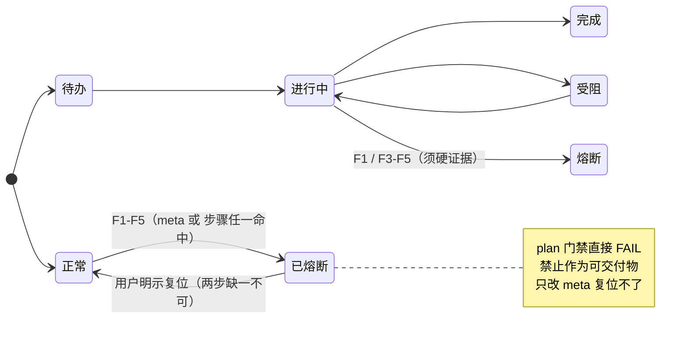

# 状态模型（ai-workflow 显式状态机）

> **定位**：把 ai-workflow 里**原本散落在 prose + 枚举**的状态与迁移，形式化为**唯一口径源**。它回答一个问题：**「什么状态 → 什么迁移 → 谁有资格触发」**。
> **版本**：1（2026-09-21，P0-2 新增）
>
> ⚠️ **权威性声明**：本文件是**状态的唯一口径源**。`SKILL.md` 的熔断机制节、`assets/plan-template.yaml` 的注释、`assets/熔断报告模板.md` 的复位步骤**均为引用/摘要**，如与本文件冲突以本文件为准。
> ⚠️ **建模边界（不建模的东西，写在最前面）**：本状态机只描述**可机判定的状态与迁移**。**「为什么进入某状态」（决策）、「人类是否该熔断/复位」（判断）、「反思质量/放行真实性」（诚实度）不在建模范围内** —— 它们是决策层与纪律层的事，硬塞进状态机会制造「有状态机却什么也没保证」的假安全感。详见 §4。

---

## 一、状态集合（两个正交的状态域）

**共两个存储域，务必分开看**（`SKILL.md` 曾专门订正过二者易混）：

| 域 | 载体字段 | 取值 | 存储态？ |
| --- | --- | --- | --- |
| **A. 步骤状态** | `steps[].状态` | 待办 / 进行中 / 完成 / 受阻 / 熔断 | 是 |
| **B. 熔断状态** | `meta.熔断状态` | 正常 / 已熔断 | 是 |

> ⚠️ **「复位」不是第三个存储态** —— 它是一次**迁移动作**（Half-Open），由用户明示后把 B 从 `已熔断` 迁回 `正常`。把复位写进枚举是常见错误。

---

## 二、迁移表（合法迁移 + 守卫 + 谁有资格触发）

### 2.1 步骤状态（域 A）

| 从 | 到 | 守卫 / 条件 | 触发者 |
| --- | --- | --- | --- |
| 待办 | 进行中 | 开始执行该步 | 主代理 |
| 进行中 | 完成 | 该步「验证方式」出示可判定证据 | 主代理 |
| 进行中 | 受阻 | 遇阻但未耗尽重试 | 主代理 |
| 受阻 | 进行中 | 解除受阻 | 主代理 |
| 进行中 | 熔断 | 命中 **F1**（返修 2 轮 + 对抗互审仍不过）或环境类硬失败 F3–F5 | 主代理（须硬证据） |
| 熔断 | 完成 / 受阻 / 待办 / 进行中 | **仅复位后**，且**仅一次**针对性重试 | **用户明示**后由主代理执行 |

### 2.2 熔断状态（域 B）

| 从 | 到 | 守卫 / 条件 | 触发者 |
| --- | --- | --- | --- |
| 正常 | 已熔断 | 命中 F1–F5 任一（**每条须硬证据**，缺证据不构成触发） | 主代理 |
| 已熔断 | 正常（复位） | **用户明示**；且**必须是两步**（见 §3） | **仅用户** |

---

## 三、复位＝一次迁移动作，且**两步缺一不可**

> 依据：熔断由**两个独立条件**触发（`meta.熔断状态` **或** 任一步骤状态为 `熔断`，任一命中即阻断，fail-closed 设计）。因此**只改一个复位不了**。

```
复位（用户明示后）:
  1) meta： checks.py mark <plan> --fuse 正常      # B: 已熔断 -> 正常
  2) 步骤： checks.py mark <plan> <id> <非熔断状态>  # A: 熔断 -> 完成/受阻/待办/进行中
  合成：   checks.py mark <plan> <id> 完成 --fuse 正常
  3) 重跑 checks.py plan <plan> --base <工作区根> 确认 FAIL 清零（输出留档）
  4) Ledger.md 记录复位依据（用户原话摘要 + 时间）
```

**不变量**：复位后**只允许一次**针对性重试；同一条件再次触发 → 再次熔断，升级为「需用户改方案」。

---

## 四、守卫的「已机判 / 仍靠纪律」对应表（**不得把纪律伪装成门禁**）

| 守卫 | 状态 | 由谁实现 |
| --- | --- | --- |
| `熔断状态 ∈ {正常, 已熔断}` | ✅ 已机判 | `checks.py plan` 的 `_check_fuse` |
| `状态 ∈ {待办,进行中,完成,受阻,熔断}` | ✅ 已机判 | `_check_fuse` / `VALID_STATUS` |
| 任一步骤 = `熔断` → `plan` 直接 FAIL | ✅ 已机判 | `_check_fuse` |
| `meta.熔断状态 = 已熔断` → `plan` 直接 FAIL | ✅ 已机判 | `_check_fuse` |
| 已熔断时同目录须有《熔断报告.md》且含五节 | ✅ 已机判 | `_check_fuse` + `FUSE_SECTIONS` |
| 复位须**用户明示** | ❌ 纪律（无法机判"是否用户说的"） | 人审 + `Ledger.md` 留痕 |
| 复位后**只允许一次**重试 | ❌ 纪律（`checks.py` 不记录复位次数） | 人审 |
| F1–F5 是否**真有硬证据** | ❌ 半纪律（触发编号可查，证据真实性靠审） | 人审 + 熔断报告 |

> **一句话**：状态机把「**状态的合法性与阻断**」机判化（左列），把「**人的判断与诚实**」保留为纪律（右列）。**两侧都写全**才是诚实的状态模型 —— 只写左列会让人误以为"复位次数也被管着"。

---

## 五、状态机图（mermaid）



---

## 六、与各处的接缝

| 位置 | 关系 |
| --- | --- |
| `SKILL.md` 熔断机制 | 引用本文件；本文件为唯一口径源 |
| `checks.py plan` 的 `_check_fuse` | 本文件 §二/§四左列的可执行实现 |
| `assets/熔断报告模板.md` | 「复位条件」节的 §三 引用本文件 |
| `references/data-model.md` §2.2 | 状态**取值**登记处（受守卫镜像）；本文件管**迁移**，二者互补 |
| `references/reflection-retry.md` | 反思重试耗尽 → 升级到四返修复查 → 触顶触发 F1（进入本状态机） |

---

## 变更记录

- **v1（2026-09-21，P0-2）**：新增本文件。把「两个存储域 + 复位两步迁移」形式化为显式状态机（§一/§二/§三）、补守卫「已机判/仍靠纪律」对应表（§四）与 mermaid 图（§五）。
  - **阴性对照（实测）**：① 仅改 `meta.熔断状态` 而步骤仍为 `熔断` → `plan` **仍 FAIL**（证明"两步缺一不可"）；② 步骤 `熔断`、meta `正常` → FAIL；③ 两步复位 → FAIL 清零。原始输出见 `tasks/P0建模落地-2026-09-21/tmp/out_stateprobe.txt`。
  - ⚠️ **范围订正**：本文件**不新增门禁**（依 P0-2 决策 D3=A）—— 只把既有 `_check_fuse` 的行为**显式化**，并用对拍证明描述与实现一致；未增加"状态迁移合法性"的新校验。
